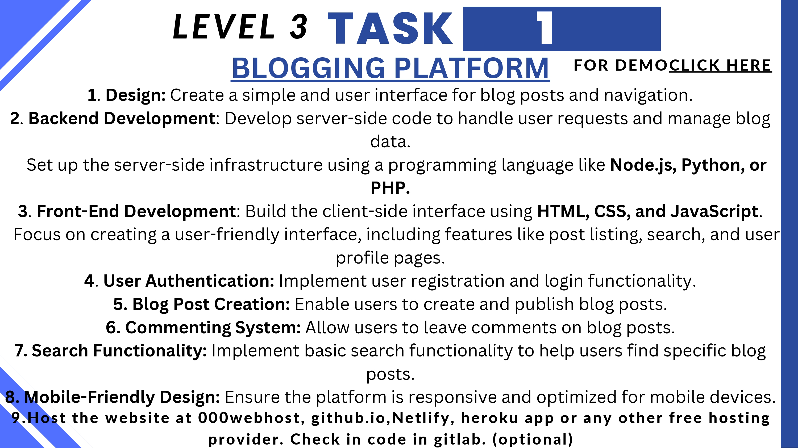

# CuriousQuill

This is a blog application. I have done this project as a part of my Internship at CodSoft.

## Features:
#### Authentication:
User can authenticate using Google or Facebook or Email and Password. The authentication is done using Firebase Authentication.

### Create Post:
User can create a post by clicking on the create post button. The post will be saved in the database and will be displayed in the home page.

### Edit Post:
User can edit the post by clicking on the edit button. The post will be updated in the database and will be displayed in the home page.

### Delete Post:
User can delete the post by clicking on the delete button. The post will be deleted from the database and will be removed from the home page.

## Technologies Used:
- React JS
- Firebase
- Vite
- Tailwind CSS
- React Icons
- React Router DOM
- React Toastify
- TinyMCE

## Deployed Link:
https://curious-quill.netlify.app/

