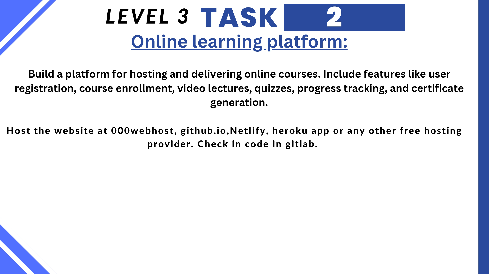

# Knowledge Kite

This is a Online Entry test preparation application. I have done this project as a part of my Internship at CodSoft.

## Features:
#### Authentication:
User can authenticate using Google or Facebook or Email and Password. The authentication is done using Firebase Authentication.

## Technologies Used:
- React JS
- Firebase
- Vite
- Sanity
- Tailwind CSS
- React Icons
- React Router DOM
- React Toastify

## Deployed Link:
https://knowledgekite.netlify.app/

